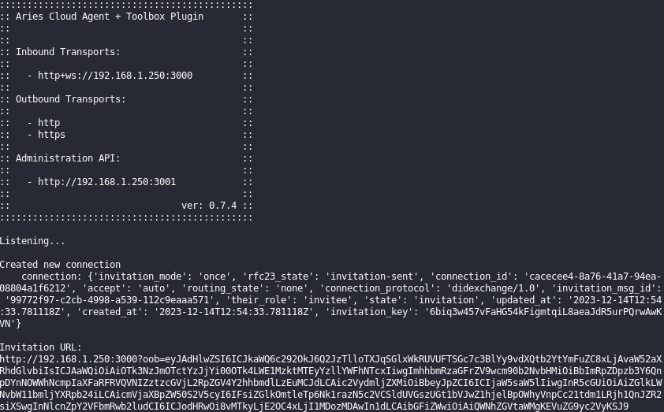

# Deprecation Notice

This project was created using the Hyperledger project’s [Aries Cloud Agent - Python Plugin for Aries Toolbox](https://github.com/hyperledger/aries-acapy-plugin-toolbox).


# Aries Cloud Agent - Python Plugin for Aries Toolbox


## Installation

Requirements:
- Python 3.6 or higher
- ACA-Py 0.7.4

### Setup Aries Cloud Agent - Python

If you already have an existing installation of ACA-Py, you can skip these steps
and move on to [plugin installation](#plugin-installation). It is also worth
noting that this is not the only way to setup an ACA-Py instance. For more setup
configurations, see the [Aries Cloud Agent - Python
repository](https://github.com/hyperledger/aries-cloudagent-python).

First, clone
[ACA-Py](https://github.com/hyperledger/aries-cloudagent-python) and prepare a
virtual environment:
```sh
$ git clone https://github.com/hyperledger/aries-cloudagent-python
$ cd aries-cloudagent-python
$ python3 -m venv env
$ source env/bin/activate
```

Install ACA-Py into the virtual environment:
```sh
$ pip install -e .
```
Note: If you are using the `indy` feature, you will need to have the indy-sdk
library installed. If it's not installed, please see
[Installing the SDK](https://github.com/hyperledger/indy-sdk/blob/master/README.md#installing-the-sdk)

### Plugin Installation

Install this plugin into the virtual environment:

```sh
$ pip install git+https://github.com/hyperledger/aries-acapy-plugin-toolbox.git@main#egg=acapy_plugin_toolbox
```

**Note:** Depending on your version of `pip`, you may need to drop the
`#egg=...` to install the plugin with the above command.

### Plugin Loading

Alternatively, you may use the demo configs in `demo/configs` to startup ACA-Py
similarly to the demos. These demos automatically set many options, such as
ports, config options, plugins to load, etc. To do so, copy one of the config
files to the current directory and run the following command, substituting
`./{config}.yml` with the config file you have chosen:
```
aca-py start --arg-file ./{config}.yml
```
What needs to be modified in the yml file is as follows: 
```
# Admin
admin: [Your IP Addr:(port number specified by you + 1)]

# Transport
inbound-transport:
  - [acapy_plugin_toolbox.http_ws, Your IP Addr:port number specified by you]
outbound-transport: http
endpoint:
  - http://Your IP Addr:port number specified by you
  - ws://Your IP Addr:port number specified by you

# Ledger
genesis-url: http://Your Genesis URL from Ledger/genesis

# Wallet
wallet-name: Your Wallet Name(Your Company)
wallet-type: indy
wallet-key: "insecure, for use in demo only"
auto-provision: true
```
### Create an invitation to connect to Toolbox



When you start ACA-Py through the modified yml file, the screen above appears. The 'Invitation URL' in the picture is the address used when connecting to Aries Toolbox. Use the URL to connect between Aries Toolbox and Agent.

Once you have completed all processes, you can proceed with running [Aries-Toolbox](https://github.com/hyperledger/aries-toolbox).

### Using Indy Verifiable Credentials

To use all the features of the toolbox, you'll need the `indy` feature installed


## License

[Apache License Version 2.0](https://github.com/hyperledger/aries-acapy-plugin-toolbox/blob/main/LICENSE)
