# Notice

This project was created using the Hyperledger project’s [aries-toolbox](https://github.com/hyperledger/aries-toolbox).
This project is the ‘On-Campus DID Identity Authentication System’ project conducted by ‘INSlab (Hoseo University)’.
[ACA-Py](https://github.com/hyperledger/aries-cloudagent-python) and [Aries-ACAPy-plugin-toolbox](https://github.com/hyperledger/aries-acapy-plugin-toolbox) must be configured.


# Aries Toolbox

The Toolbox makes interacting with Aries Agent easier for developers and system
administrators.  Toolbox Modules provide user interface for protocols. Debugging
information and details are included and visible.

The ToolBox uses the Discover Features Protocol to determine which protocols are
supported by the connected agent, and will customize the menu of modules to
match supported protocols.


## Build Setup
Requirements:
- Python 3.6 or higher
- npm 9.8.1
- ACA-PY 0.7.4

``` bash
# Clone the Aries Toolbox:
$ git clone https://github.com/hyperledger/aries-toolbox.git

# install dependencies
$ npm install
$ npm run dev
```

## Connect ACA-Py and the Toolbox
In ACA-Py, paste the invitation URL of the plugin into ‘New Agent Connection’.

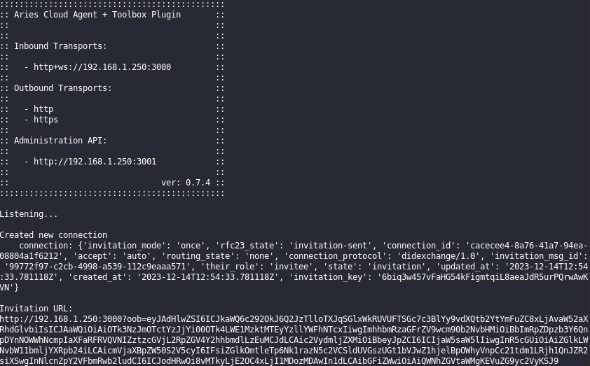

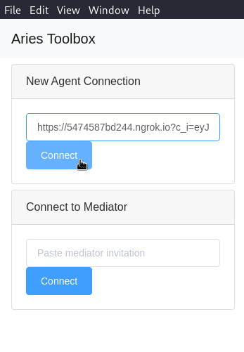

Open the newly created connection.

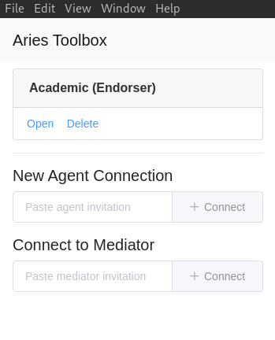
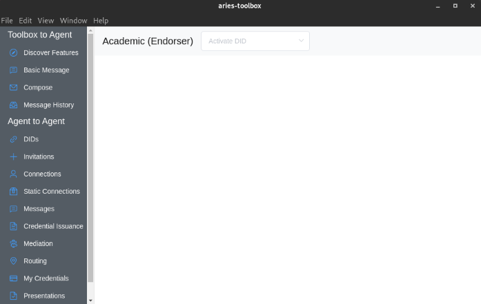


## Create a new Invitation
Create a new Connection Invitation by completing the form. Enter a reasonable alias and ensure auto-accept is checked.

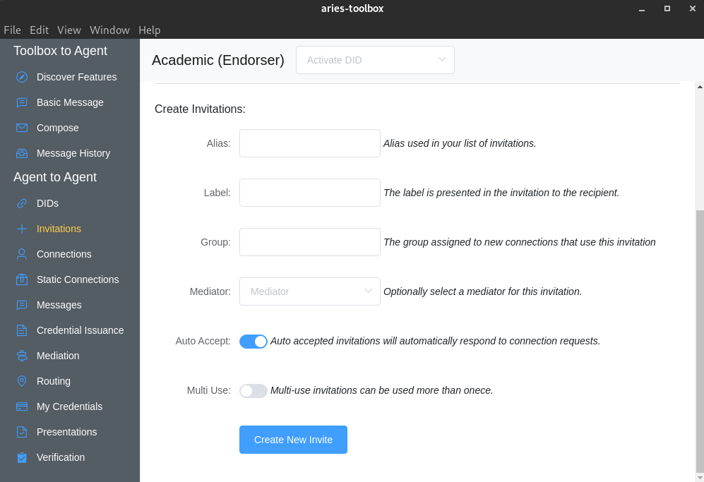

Click the row of the newly created invitation to expand it then click Scan QR to display a QR code on screen.

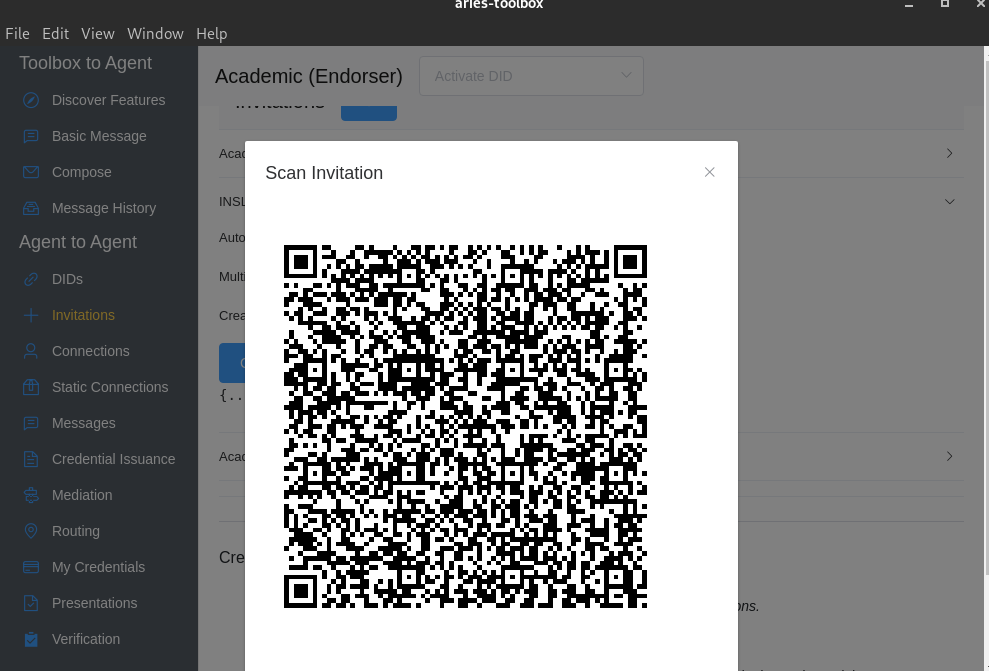

You can establish a connection with the agent by scanning the corresponding qrcode in 'Trinsic Wallet'.

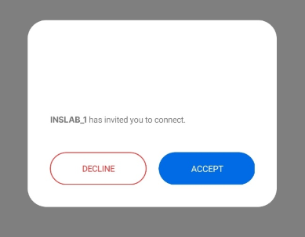

Once the connection is established, you can see the list of connections under 'Connections'.

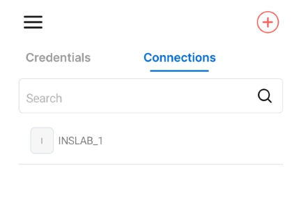

## Send a message from Trinsic to ACA-Py

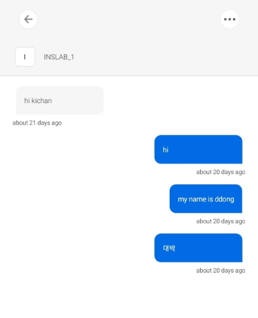

You can Send the connection a new message.

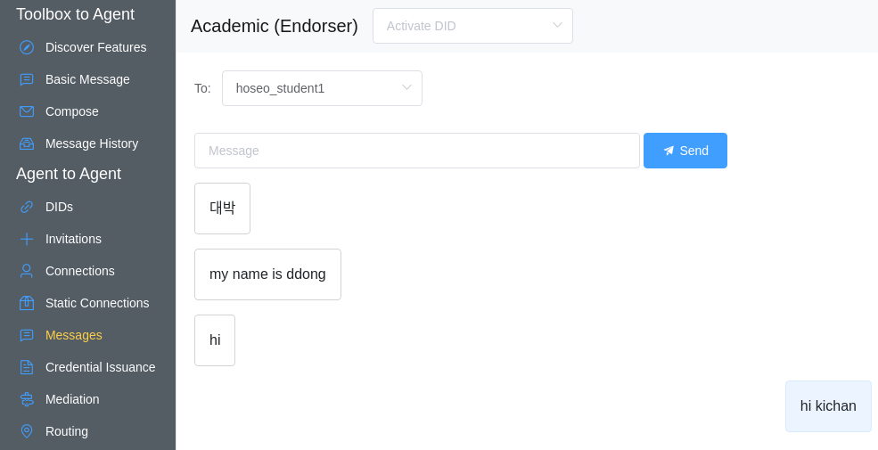
you can also check it in 'Connections' in 'Toolbox'.

## Register DID in ledger

When running the Agent, you must first obtain Endorser authority with your DID. Check your 'verkey' and 'did' in the DID item in Toolbox.

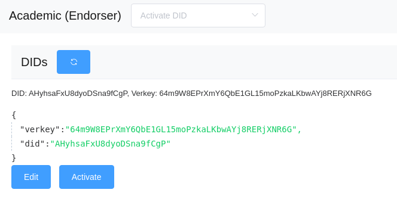

Afterwards, register the corresponding ‘verkey’ and ‘did’ on the ledger homepage.

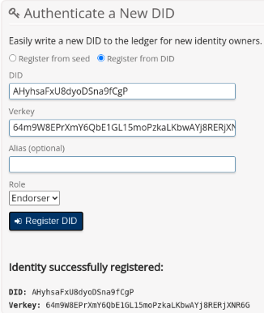


## Make Credential Schema, Definition

Once Endorser permission is obtained, the Agent must create a Credential Schema and Credential Definition for the VC it wishes to issue.

***1. Create student ID schema***

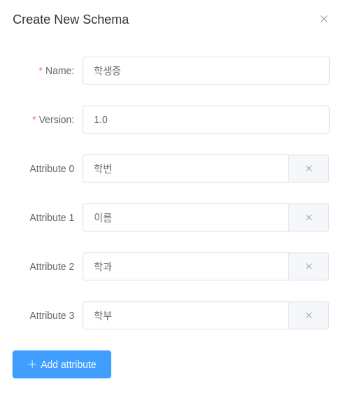

***2. Student ID schema registered in the ledger***

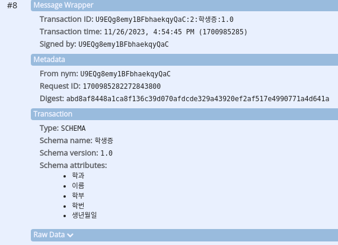

***3. Creating student ID Credential Definition using student ID schema***

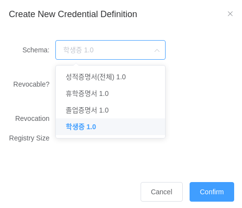

***4. Student ID Definition registered in the ledger***

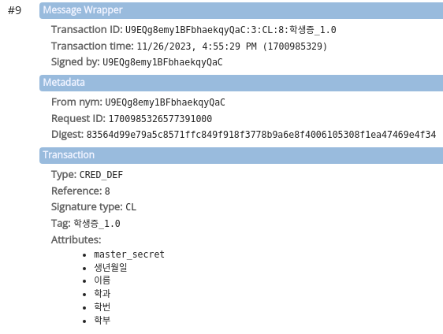

Various school certificates, such as transcripts and graduation certificates, are also created in the same way.

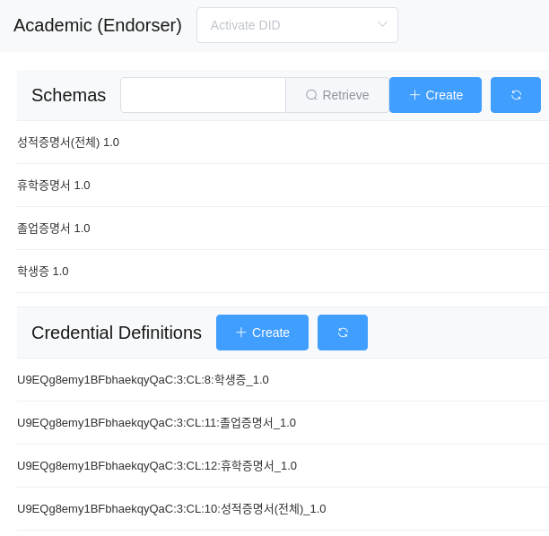

Now all preparations for the Agent have been completed. Afterwards, VC can be issued, and upon issuance, it is stored in the user's digital wallet application.

---

This project was created with [vue-electron-template](https://github.com/mubaidr/vue-electron-template/).

Documentation about the original structure
([electron-vue](https://github.com/SimulatedGREG/electron-vue)) can be found
[here](https://simulatedgreg.gitbooks.io/electron-vue/content/index.html).
