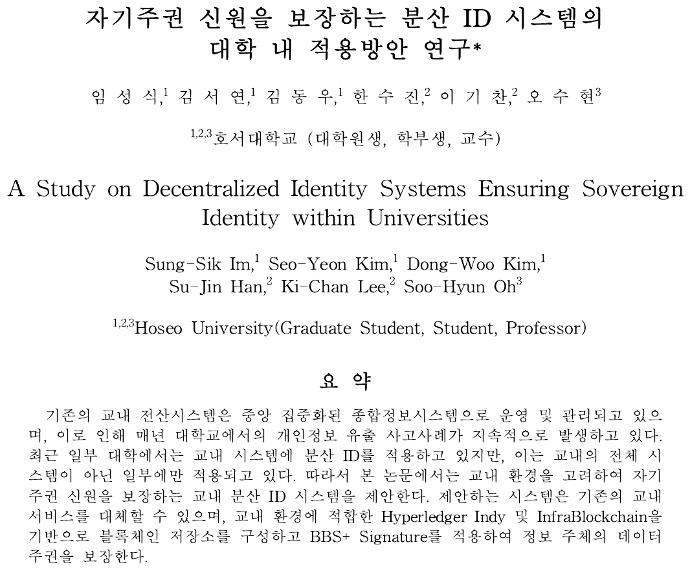

---

# DID Authentication System

 

---

## Decentralized Identity (DID)

---

- Technology for identity authentication in a ‘decentralized’ environment, breaking away from existing centralized identity authentication
- Utilizing ‘blockchain’ technology in the process

- `W3C` establishes standards for DID

 

## DID standard configuration model established by `W3C`

 

- VC = Verifiable Credential
    > Electronic ID, certificate

- VP = Verifiable Presentation
  > Proof that extracts only the information that VC wants to verify

 

---

## Hyperledger
  
---

   

- Hyperledger is the Linux Foundation's blockchain open source project.
- A private blockchain platform suitable for implementing corporate and institutional projects
- A technology that is not specialized in finance but can be adopted universally in many industries

   

 
- Provides tools, libraries, and reusable components for creating and using independent digital identity records based on blockchain.

   

- Hyperledger Aries is your complete toolkit for decentralized identity solutions and digital trust. Issue, store and present verifiable credentials with maximum privacy preservation, and establish confidential, ongoing communication channels for rich interactions. It supports multiple protocols, credential types, ledgers and registries.
  
--- 
## System Configuration
---

- Schools issue various certificates and identification cards to students and faculty members as issuers
- Users use the relevant certificate and identification card to the verifier
--- 
## Aries-Toolbox (School Side)
---

- Tools for System Administrators
- Tools that can establish connections with students, generate and issue different certificates

--- 
## Trinsic Wallet (Student Side)
---

- Mobile applications, tools to facilitate DID communication with schools
- Digital wallet for users on the DID network
- Receive, store, and validate digital credentials

---
## Creating VP with VC
---

- Students can create VP through their own student ID, certificate, etc
- Only desired properties within the VC can be written to VP
- Perform verification by sending only the generated VP without exposing the VC
